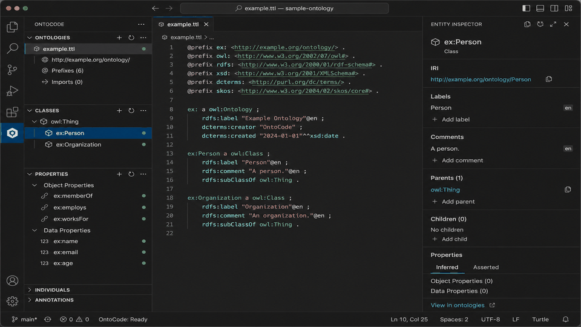
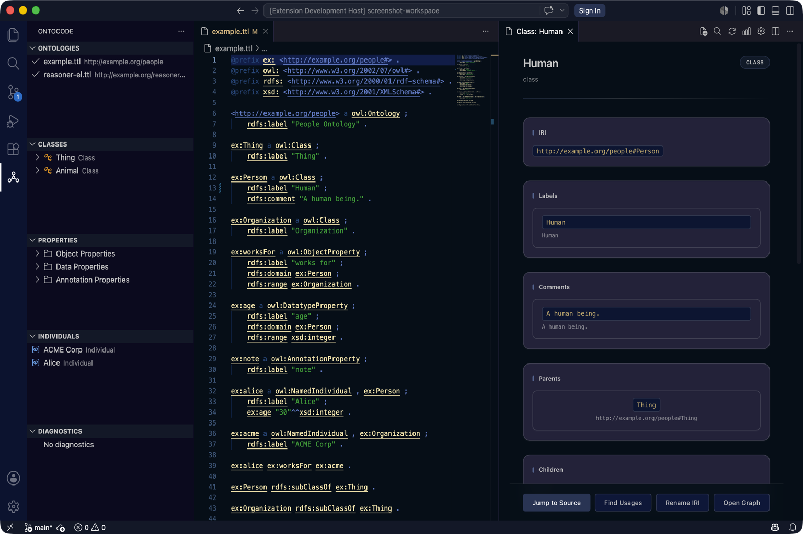
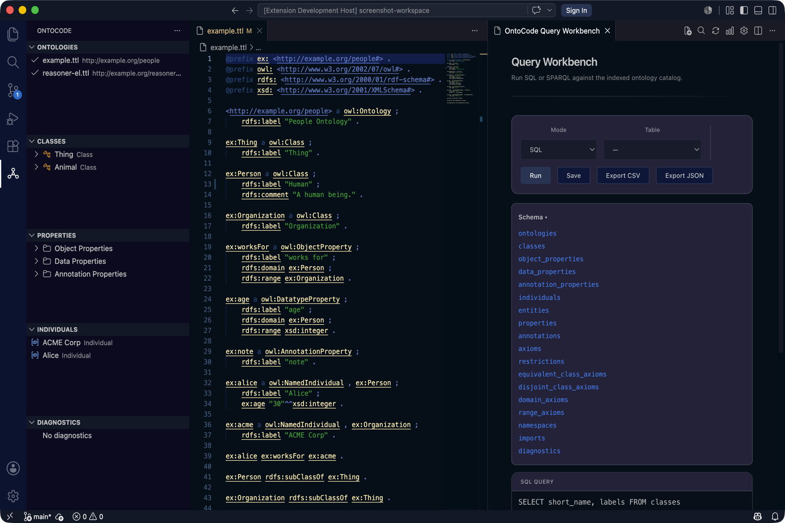

# OntoCode

**OntoCode** edits OWL/RDF/OBO ontologies in VS Code. Install the [extension](https://marketplace.visualstudio.com/items?itemName=ontocode.ontocode) (publisher **OntoCode**, id `ontocode.ontocode`), open a folder of `.ttl` / `.obo` / `.owl` files, and use the **OntoCode** activity bar.

**Next:** [First success (~10 min)](https://ontocode-vs.readthedocs.io/en/latest/guides/first-success/) — no clone required.

**Current release: v0.24.0** · [What ships today](https://ontocode-vs.readthedocs.io/en/latest/SHIPPED/) · [Changelog](CHANGELOG.md) · [Docs](https://ontocode-vs.readthedocs.io/en/latest/)

[](https://github.com/eddiethedean/ontocode/actions/workflows/ci.yml)
[](https://github.com/eddiethedean/ontocode/blob/main/LICENSE-MIT)
[](https://ontocode-vs.readthedocs.io/en/latest/)
[](https://marketplace.visualstudio.com/items?itemName=ontocode.ontocode)
[](https://open-vsx.org/extension/ontocode/ontocode)
[](https://crates.io/crates/ontocore)



## Start here

| I want to… | Start here |
|------------|------------|
| **Edit ontologies in VS Code** | **[First success (~10 min)](https://ontocode-vs.readthedocs.io/en/latest/guides/first-success/)** |
| Validate or query in CI | **Linux x64:** release tarball → [CI guide](https://ontocode-vs.readthedocs.io/en/latest/ci-integration/). **macOS/Windows:** [Install CLI](https://ontocode-vs.readthedocs.io/en/latest/guides/install-cli/) (`cargo install` 15–30+ min) |
| Decide if it fits | [Known limitations](https://ontocode-vs.readthedocs.io/en/latest/known-limitations/) · [What ships today](https://ontocode-vs.readthedocs.io/en/latest/SHIPPED/) · [Versions & channels](https://ontocode-vs.readthedocs.io/en/latest/guides/versions-and-channels/) · [Evaluate pack](https://ontocode-vs.readthedocs.io/en/latest/guides/enterprise-eval/) |
| Try examples | [Examples](https://ontocode-vs.readthedocs.io/en/latest/examples/) · repo [`examples/`](examples/) |
| Embed in Rust | [Rust library guide](https://ontocode-vs.readthedocs.io/en/latest/guides/rust-library/) |
| Contribute | [CONTRIBUTING.md](CONTRIBUTING.md) |

Full documentation: **[Read the Docs](https://ontocode-vs.readthedocs.io/en/latest/)**. You do not need to clone this repo to use the extension or installed CLI.

## See it in action

[Feature tour](https://ontocode-vs.readthedocs.io/en/latest/ontocode/feature-tour/) · [First success](https://ontocode-vs.readthedocs.io/en/latest/guides/first-success/) (~10 min, no clone)

<p>


</p>

## Install

| Install | Command / link |
|---------|----------------|
| **VS Code extension** | [Marketplace](https://marketplace.visualstudio.com/items?itemName=ontocode.ontocode), [Open VSX](https://open-vsx.org/extension/ontocode/ontocode) (Cursor), or [GitHub Releases](https://github.com/eddiethedean/ontocode/releases) `ontocode-v0.24.0.vsix` |
| **CLI (Linux x64)** | Download `ontocore-v0.24.0-x86_64-unknown-linux-gnu.tar.gz` from [Releases](https://github.com/eddiethedean/ontocode/releases), verify `SHA256SUMS`, then `ontocore validate /path/to/ontologies` |
| **CLI (macOS/Windows)** | `cargo install ontocore-cli --locked --version 0.24.0` (Rust 1.88+; first compile 15–30+ min) or use the language server bundled in the VSIX |
| **Crates** | [`ontocore`](https://crates.io/crates/ontocore) on [crates.io](https://crates.io/search?q=ontocore) |

Release CLI tarballs are **Linux x64 only**. Most IDE users never need the CLI — the extension bundles `ontocore-lsp`.

> **Names:** **OntoCode** = VS Code extension. **OntoCore** = Rust engine (`ontocore` CLI + `ontocore-lsp`). **Ontologos** = external reasoner. This GitHub repo is `ontocode` — install the CLI with **`cargo install ontocore-cli`**, not `ontocode`.

**Editable today:** Turtle (`.ttl`), OBO (`.obo`), RDF/XML (`.owl`/`.rdf`), and OWL/XML (`.owx`). XML saves are **semantic re-serialize** (not byte-identical to Protégé). JSON-LD / N-Triples / TriG remain read-only — [Supported formats](https://ontocode-vs.readthedocs.io/en/latest/supported-formats/) · [Known limitations](https://ontocode-vs.readthedocs.io/en/latest/known-limitations/).

Evaluators: use [What ships today](https://ontocode-vs.readthedocs.io/en/latest/SHIPPED/) and [Known limitations](https://ontocode-vs.readthedocs.io/en/latest/known-limitations/) as the capability source of truth. GitHub trees `docs/protege-parity/` and `docs/PROTEGE_REVERSE_ENGINEERING/` are engineering notes, not product claims.

## Quick start

**VS Code:** Install [OntoCode](https://marketplace.visualstudio.com/items?itemName=ontocode.ontocode) → open a folder of **`.ttl` / `.obo` / `.owl` / `.rdf` / `.owx`** (editable) or JSON-LD / TriG / N-Triples (browse/query only) → click the **OntoCode** activity bar. Edit in the Entity Inspector. XML write-back is semantic re-serialize — see [OWL/XML and RDF/XML write-back](https://ontocode-vs.readthedocs.io/en/latest/guides/owl-xml-workflow/) and [Supported formats](https://ontocode-vs.readthedocs.io/en/latest/supported-formats/). OntoCode’s **bundled** language server runs in trusted and Restricted Mode; **Trust** only if you set custom `ontocode.lspPath` or `ontocode.robotPath`.

**CLI (Linux x64 CI):** download the release tarball, verify checksums, then validate — [CI integration](https://ontocode-vs.readthedocs.io/en/latest/ci-integration/).

**CLI (macOS/Windows or from source):** Prefer the [Install CLI guide](https://ontocode-vs.readthedocs.io/en/latest/guides/install-cli/). First `cargo install` compiles dependencies — expect **15–30+ minutes** on a cold machine (Rust 1.88+; Windows needs [MSVC Build Tools](https://visualstudio.microsoft.com/visual-cpp-build-tools/); macOS needs Xcode CLT). Pin releases in CI.

```bash
cargo install ontocore-cli --locked --version 0.24.0
# Catalog SQL (subset) — not full SQL; see docs
ontocore query /path/to/ontologies "SELECT * FROM classes"
ontocore validate /path/to/ontologies
# Requires a git repository (run from your ontology repo root):
ontocore diff HEAD..WORKTREE
ontocore docs /path/to/ontologies --format markdown --output ./docs-out
```

**CLI (clone):**

```bash
git clone https://github.com/eddiethedean/ontocode.git && cd ontocode
cargo run -- query fixtures "SELECT * FROM classes"
cargo run -- validate fixtures
```

## Architecture

```text
┌──────────────────────────────────────────────────────────────┐
│  OntoCode (VS Code) ──ontocore-lsp──► OntoCore (Rust engine) │
│  index · query · diagnostics · refactor · diff · CLI · LSP   │
└──────────────┬─────────────────────────────┬───────────────────┘
               ▼                             ▼
        ┌─────────────┐              ┌──────────────────┐
        │  Ontologos  │              │  Oxigraph /      │
        │  reasoning  │              │  Horned-OWL      │
        └─────────────┘              └──────────────────┘
```

Platform docs: [Vision](https://ontocode-vs.readthedocs.io/en/latest/vision/) · [Architecture](ARCHITECTURE.md) · [Roadmap hub](https://ontocode-vs.readthedocs.io/en/latest/roadmap-hub/) · [Protégé vs OntoCode](https://ontocode-vs.readthedocs.io/en/latest/guides/protege-decision/)

**v0.24.0** ships semantic services: Protégé-style DL Query (Workbench DL mode / `ontocore dl-query`) and richer refactoring (multi-format rename/merge/replace; Turtle-first move/extract/ontology-merge). See [SHIPPED](https://ontocode-vs.readthedocs.io/en/latest/SHIPPED/), [v0.24 migration](docs/migration/v0.24.md).

## Development

See [CONTRIBUTING.md](CONTRIBUTING.md). Quick checks:

```bash
cargo test --workspace
cargo build -p ontocore-lsp --bins
cd extension && npm ci && ONTOCORE_LSP_BIN=../target/debug/ontocore-lsp npm test
cd extension/webview-ui && npm ci && npm test
cargo fmt --all && cargo clippy --workspace --all-targets --all-features -- -D warnings
```

**Full CI parity:** `./scripts/run-ci-local.sh`

## License

MIT OR Apache-2.0. Third-party licenses: [LICENSES](https://ontocode-vs.readthedocs.io/en/latest/design/LICENSES/). Security: [security policy](https://ontocode-vs.readthedocs.io/en/latest/security/).
