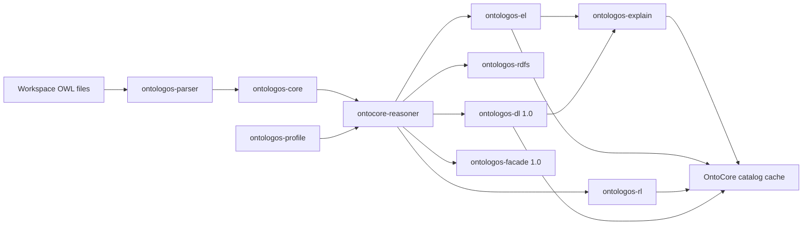

# REASONER_SPEC.md

## 1. Purpose

Reasoner support is **P0** for Protégé-competitive v1.0 ([PROTEGE_PARITY.md](PROTEGE_PARITY.md)).

OntoCode must support classification, consistency checking, inferred hierarchy browsing, and **real explanation workflows** — not placeholders.

**Hard constraints:**

- [ADR-0014](adr/0014-rust-native-reasoners-only.md) — **no Java or JVM reasoners**, ever.
- [ADR-0015](adr/0015-adopt-ontologos-reasoner.md) — reasoning delegates to **[OntoLogos](https://github.com/eddiethedean/ontologos)** crates, not an in-tree DL engine.

## 2. Reasoner Adapter Model

Reasoners are Rust components behind a common OntoCore trait. **`ontocore-reasoner`** is a thin integration crate that wraps OntoLogos engines.

```rust
pub trait ReasonerAdapter {
    fn name(&self) -> &str;
    fn profile(&self) -> ReasonerProfile; // EL, RL, RDFS, DL
    fn classify(&self, input: ReasonerInput) -> Result<ClassificationResult>;
    fn check_consistency(&self, input: ReasonerInput) -> Result<ConsistencyResult>;
    fn unsatisfiable_classes(&self, input: ReasonerInput) -> Result<Vec<EntityIri>>;
    fn explain(&self, input: ExplanationRequest) -> Result<ExplanationResult>;
}
```

Input is built from workspace ontology files via `ontologos-parser` (or bridged from `ontocore-owl` per [ADR-0013](adr/0013-dual-stack-oxigraph-horned-owl.md)). Results are cached in the OntoCore catalog for LSP and explorer inferred views.

### Required adapters by v1.0 (P0)

| Adapter | OntoLogos backend | OntoLogos version | Profile | Role |
|---------|-------------------|-------------------|---------|------|
| **`el`** | `ontologos-el` | 0.9.0+ | OWL EL | Default for OBO and large EL TBoxes |
| **`dl`** | `ontologos-dl` | **1.0.0+** | OWL 2 DL | Classification, consistency, unsatisfiable classes, **explanations** |

### Bundled adapters (P1)

| Adapter | OntoLogos backend | OntoLogos version | Profile | Role |
|---------|-------------------|-------------------|---------|------|
| **`rl`** | `ontologos-rl` | 0.9.0+ | OWL 2 RL | RL saturation when DL is unnecessary |
| **`rdfs`** | `ontologos-rdfs` | 0.9.0+ | RDFS | Explicit RDFS materialization |
| **`auto`** | `ontologos-facade` | **1.0.0+** | Multi | Profile auto-routing |

Explanations use `ontologos-explain` (EL-first in 0.9.0; full DL clash traces with `ontologos-dl` at 1.0.0).

### Explicitly excluded

- ELK, HermiT, Pellet, RDFox JVM builds — **non-goals** per ADR-0014.
- Direct `whelk-rs` or `reasonable` dependencies in OntoCore — use OntoLogos facades ([ADR-0015](adr/0015-adopt-ontologos-reasoner.md)).
- External Java subprocesses for reasoning.

## 3. Reasoner Operations

### 3.1 Run Classification

Command: `OntoCode: Run Reasoner`

Settings:

| Setting | Purpose |
|---------|---------|
| `ontocode.reasoner.default` | `el` \| `dl` \| `rl` \| `rdfs` \| `auto` (workspace-trusted) |
| `ontocode.reasoner.autoProfile` | Use `ontologos-profile` detection; suggest `el` when EL-detectable |

Output:

- inferred class hierarchy
- changed inferred relationships
- unsatisfiable classes
- warnings/errors (e.g. ontology outside selected profile)

### 3.2 Inspect Unsatisfiable Class (P0)

User clicks an unsatisfiable class. OntoCode shows:

- class IRI and labels
- asserted axioms involving the class
- inferred conflicts
- **justification chain** (see §7) from `ontologos-explain` via the `dl` adapter (1.0.0+)

### 3.3 Compare Asserted vs Inferred Hierarchy

Explorer toggle:

- asserted hierarchy
- inferred hierarchy
- combined hierarchy

## 4. Rust reasoner stack



- **`ontocore-reasoner`:** trait, input bridge, result cache, LSP JSON — **not** a reasoner implementation.
- **`ontologos-el`:** in-house EL completion (v0.6+ with 0.9.0).
- **`ontologos-rl` / `ontologos-rdfs`:** delegate to reasonable via `ontologos-bridge` (P1).
- **`ontologos-dl`:** OWL 2 DL engine — **v1.0 blocker**; ships with OntoLogos 1.0.0 publish.
- **`ontologos-facade`:** `classify --profile auto` routing — v1.0.

## 5. Profile selection

| Profile | Adapter | OntoLogos | When to use |
|---------|---------|-----------|-------------|
| OWL EL | `el` | `ontologos-el` | OBO, SNOMED-style TBoxes, EL-detectable ontologies |
| OWL 2 RL | `rl` | `ontologos-rl` | Rule-like closure, ABox-heavy RL workloads |
| RDFS | `rdfs` | `ontologos-rdfs` | Explicit RDFS materialization |
| OWL 2 DL | `dl` | `ontologos-dl` | General OWL 2 DL authoring; **required** for full unsat explanations |
| Auto | `auto` | `ontologos-facade` | Let OntoLogos route by detected profile (1.0.0+) |

UI shows active profile and warns when axioms exceed the selected profile (e.g. DL axioms with `el` only). Use `ontologos-profile` diagnostics for construct-out-of-profile messages.

## 6. Explanations (P0 — v1.0 blocker)

Provided by **`ontologos-explain`**, backed by `dl` for full DL clash traces at OntoLogos 1.0.0.

| Capability | Requirement | OntoLogos version |
|------------|-------------|-------------------|
| Unsatisfiable class detection | P0 | 0.9.0 (`el`); 1.0.0 (`dl`) |
| Clash-trace / justification chain | P0 | 1.0.0 (`dl` + `explain`) |
| Jump from axiom in chain to source | P0 | OntoCore LSP |
| LSP `ontocore/getExplanation` | P0 | OntoCore maps `ontologos-explain` output |

**Explanation panel** ([UI_WIREFRAMES.md](UI_WIREFRAMES.md) §7):

- Tree or ordered list of axioms in the justification
- Click axiom → jump to source
- Re-run classification after edits

v0.6 ships EL explanations where available; v1.0 exit requires DL explanations — **gated on OntoLogos 1.0.0**.

Format is OntoCode's LSP JSON mapping of `ontologos-explain` output — UX parity with Protégé, not HermiT wire compatibility.

## 7. Instance checking (P1)

- Optional `check_instances` on `ReasonerAdapter`
- Surface in inspector for named individuals
- Implemented via `ontologos-abox` when OntoLogos 1.0+ exposes stable API

## 8. Caching

Reasoner results cached by:

- workspace content hash + `ontologos_core::Ontology` revision
- adapter name and OntoLogos crate version
- reasoner options / profile

v0.9: evaluate `ontologos-watch` for invalidating cache on file change ([ADR-0015](adr/0015-adopt-ontologos-reasoner.md)).

## 9. Testing

- Shared fixtures in `fixtures/` exercised by both OntoCore integration tests and OntoLogos conformance imports.
- Golden classification on Protégé-exported fixtures (compare inferred hierarchy).
- Unsatisfiability + explanation fixtures in `examples/protege-roundtrip/`.
- EL corpus via `ontologos-el`; RL via `ontologos-rl`.
- v1.0: align with [OntoLogos HermiT parity report](https://github.com/eddiethedean/ontologos/blob/main/docs/internal/hermit-parity-gap-report.md).

## 10. v1.0 requirements summary

| Requirement | Tier | OntoLogos |
|-------------|------|-----------|
| `el` adapter (OWL EL) | P0 | 0.9.0 |
| `dl` adapter (OWL 2 DL classification + consistency) | P0 | **1.0.0** |
| Unsatisfiable class reporting | P0 | 0.9.0 (`el`); 1.0.0 (`dl`) |
| Real unsatisfiability explanations (clash trace) | P0 | **1.0.0** |
| Inferred hierarchy display | P0 | 0.9.0+ |
| Reasoner errors in Problems panel | P0 | OntoCore |
| `rl` / `rdfs` adapters | P1 | 0.9.0 |
| `auto` profile routing | P1 | **1.0.0** |
| Instance checking | P1 | 1.0.0 (`ontologos-abox`) |

## 11. Dependency versions

| OntoCode release | `ontologos-*` pin | Notes |
|------------------|-------------------|-------|
| v0.6 | `0.9` | EL, RL, RDFS, profile, query, explain (EL-first) |
| v1.0 | `1.0` | + `ontologos-dl`, `ontologos-facade`; DL parity gate |

Track OntoLogos progress: [github.com/eddiethedean/ontologos](https://github.com/eddiethedean/ontologos).

## 12. Transitive dependencies (via OntoLogos — do not depend directly)

| Crate | Role in OntoLogos | OntoCore access |
|-------|-------------------|------------------|
| [`reasonable`](https://crates.io/crates/reasonable) | OWL RL + RDFS materialization | `ontologos-rl`, `ontologos-rdfs` |
| [`horned-owl`](https://crates.io/crates/horned-owl) | OWL parse in `ontologos-parser` | `ontologos-parser` only (authoring uses direct horned-owl in `ontocore-owl`) |
| [`petgraph`](https://crates.io/crates/petgraph) | Taxonomy + proof graphs | `ontologos-query`, `ontologos-explain` |

See [DEPENDENCY_MATRIX.md](DEPENDENCY_MATRIX.md) and [LICENSES.md](LICENSES.md) (BSD-3 `reasonable`, LGPL-3.0 `horned-owl`).

## 13. Honest risks

- OntoCode v1.0 DL quality **tracks OntoLogos 1.0.0 HermiT parity** (~64% in progress at 2026-06-23), not a separate engine.
- Partial OWL mapping in OntoLogos applies until supported-constructs coverage grows.
- Two in-memory models (Oxigraph catalog + `ontologos_core::Ontology`) until bridge optimization.
- Zero JVM is a product requirement, not a claim of identical semantics to ELK/HermiT on every ontology.
