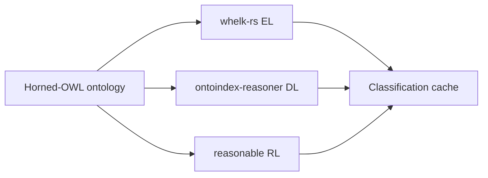

# REASONER_SPEC.md

## 1. Purpose

Reasoner support is **P0** for Protégé-competitive v1.0 ([PROTEGE_PARITY.md](PROTEGE_PARITY.md)).

OntoCode must support classification, consistency checking, inferred hierarchy browsing, and **real explanation workflows** — not placeholders.

**Hard constraint:** [ADR-0014](adr/0014-rust-native-reasoners-only.md) — **no Java or JVM reasoners**, ever.

## 2. Reasoner Adapter Model

Reasoners are Rust components (in-process or native plugin binaries) behind a common trait.

```rust
pub trait ReasonerAdapter {
    fn name(&self) -> &str;
    fn profile(&self) -> ReasonerProfile; // EL, RL, DL
    fn classify(&self, input: ReasonerInput) -> Result<ClassificationResult>;
    fn check_consistency(&self, input: ReasonerInput) -> Result<ConsistencyResult>;
    fn unsatisfiable_classes(&self, input: ReasonerInput) -> Result<Vec<EntityIri>>;
    fn explain(&self, input: ExplanationRequest) -> Result<ExplanationResult>;
}
```

Input is built from the Horned-OWL layer ([ADR-0013](adr/0013-dual-stack-oxigraph-horned-owl.md)).

### Required adapters by v1.0 (P0)

| Adapter | Implementation | Profile | Role |
|---------|----------------|---------|------|
| **`whelk`** | [whelk-rs](https://github.com/INCATools/whelk-rs) | OWL EL | Default for OBO and large EL TBoxes; fast classification |
| **`dl`** | `ontoindex-reasoner` (in-tree) | OWL 2 DL | Classification, consistency, unsatisfiable classes, **explanations** |

### Bundled adapters (P1)

| Adapter | Implementation | Profile | Role |
|---------|----------------|---------|------|
| **`reasonable`** | [reasonable](https://github.com/gtfierro/reasonable) | OWL 2 RL | Fast RL materialization when DL is unnecessary |

### Explicitly excluded

- ELK, HermiT, Pellet, RDFox JVM builds — **non-goals** per ADR-0014.
- External Java subprocesses for reasoning.

## 3. Reasoner Operations

### 3.1 Run Classification

Command: `OntoCode: Run Reasoner`

Settings:

| Setting | Purpose |
|---------|---------|
| `ontocode.reasoner.default` | `whelk` \| `dl` \| `reasonable` (workspace-trusted) |
| `ontocode.reasoner.autoProfile` | Suggest `whelk` when ontology is EL-detectable |

Output:

- inferred class hierarchy
- changed inferred relationships
- unsatisfiable classes
- warnings/errors (e.g. ontology outside selected profile)

### 3.2 Inspect Unsatisfiable Class (P0)

User clicks an unsatisfiable class. OntoCode shows:

- class IRI and labels
- asserted axioms involving the class
- inferred conflicts
- **justification chain** (see §7) from the `dl` adapter

### 3.3 Compare Asserted vs Inferred Hierarchy

Explorer toggle:

- asserted hierarchy
- inferred hierarchy
- combined hierarchy

## 4. Rust reasoner stack



- **`whelk`:** Integrate via Horned-OWL / whelk-rs APIs; classify EL ontologies (typical OBO).
- **`dl`:** Tableau (or equivalent) OWL 2 DL engine in `ontoindex-reasoner`; implements `explain` via **clash traces** (axiom justification chains).
- **`reasonable`:** Optional RL materialization path; does not replace `dl` for unsat explanations on arbitrary DL axioms.

## 5. Profile selection

| Profile | Adapter | When to use |
|---------|---------|-------------|
| OWL EL | `whelk` | OBO, SNOMED-style TBoxes, EL-detectable ontologies |
| OWL 2 RL | `reasonable` | Rule-like closure, ABox-heavy RL workloads |
| OWL 2 DL | `dl` | Default for general OWL 2 DL authoring; **required** for unsat explanations |

UI shows active profile and warns when axioms exceed the selected profile (e.g. DL axioms with `whelk` only).

## 6. Explanations (P0 — v1.0 blocker)

Provided by the **`dl`** adapter only.

| Capability | Requirement |
|------------|-------------|
| Unsatisfiable class detection | P0 |
| Clash-trace / justification chain | P0 — list of axioms involved in the derivation |
| Jump from axiom in chain to source | P0 |
| LSP `ontoindex/getExplanation` | P0 |

**Explanation panel** ([UI_WIREFRAMES.md](UI_WIREFRAMES.md) §7):

- Tree or ordered list of axioms in the justification
- Click axiom → jump to source
- Re-run classification after edits

v0.6 exit criterion: explanation panel ships — **not** a placeholder button.

Format is OntoCode’s clash-trace JSON, not HermiT’s internal justification objects — UX parity, not wire compatibility.

## 7. Instance checking (P1)

- Optional `check_instances` on `ReasonerAdapter`
- Surface in inspector for named individuals
- Implemented on `dl` adapter first

## 8. Caching

Reasoner results cached by:

- ontology catalog hash (Horned-OWL + Oxigraph)
- adapter name and version
- reasoner options / profile

## 9. Testing

- Golden classification results on Protégé-exported fixtures (compare inferred hierarchy, not JVM stdout).
- Unsatisfiability + explanation fixtures in `examples/protege-roundtrip/`.
- EL corpus for `whelk`; RL corpus for `reasonable`.
- Performance benchmarks: large OBO TBox via `whelk`, medium DL ontology via `dl`.

## 10. v1.0 requirements summary

| Requirement | Tier |
|-------------|------|
| `whelk` adapter (OWL EL) | P0 |
| `dl` adapter (OWL 2 DL classification + consistency) | P0 |
| Unsatisfiable class reporting | P0 |
| Real unsatisfiability explanations (clash trace) | P0 |
| Inferred hierarchy display | P0 |
| Reasoner errors in Problems panel | P0 |
| `reasonable` adapter (OWL RL) | P1 |
| Instance checking | P1 |
| Auto profile detection | P1 |

## 11. Honest risks

- Rust DL reasoners are younger than HermiT; v1.0 quality is **test-gated** on fixture corpora.
- Some ontologies may classify faster under `whelk` (EL) than `dl`; users choose profile explicitly when auto-detection is insufficient.
- Zero JVM is a product requirement, not a claim of identical semantics to ELK/HermiT on every ontology.
