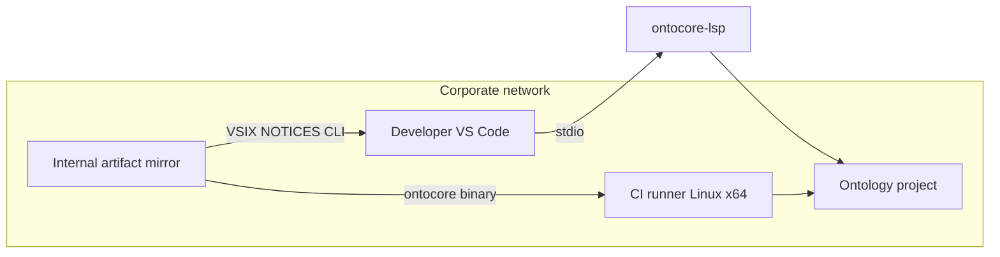

# Enterprise deployment runbook

Deploy OntoCode (VS Code) and OntoCore (CLI/LSP) in regulated, air-gapped, or centrally managed environments. Complements [enterprise evaluation](enterprise-eval.md) and [production readiness](production-readiness.md).

## Deployment patterns

| Pattern | Components | Typical owner |
|---------|------------|---------------|
| **Developer desktop** | VS Code + Marketplace, Open VSX (Cursor), or VSIX | Engineering |
| **CI validation** | `ontocore` Linux x64 binary or `cargo install` | Platform / DevOps |
| **CI + desktop** | Both | Most common enterprise pilot |
| **Air-gapped** | Internal VSIX + CLI mirror + `NOTICES` | IT security |

Ontology content stays **on disk** — no cloud upload by default ([security policy](../security.md)).

## VS Code extension rollout

### Option A — Marketplace or Open VSX (internet-connected)

1. Allowlist extension publisher **`ontocode`** and extension **`ontocode.ontocode`**
2. **Cursor / Open VSX clients:** allowlist [open-vsx.org/extension/ontocode/ontocode](https://open-vsx.org/extension/ontocode/ontocode) (v0.11.0+)
3. Pin minimum VS Code **1.85+** ([vscode-install](../vscode-install.md))
4. Document conditional **Trust workspace** policy: bundled LSP works in Restricted Mode; Trust only for custom `lspPath` / `robotPath` ([vscode-install](../vscode-install.md))
5. Communicate **multi-root** behavior — all folders are indexed since v0.10 ([FAQ](../faq.md))

### Option B — Offline / air-gapped (recommended for regulated envs)

1. On a connected staging machine, download from [GitHub Releases](https://github.com/eddiethedean/ontocode/releases) for version **v0.20.0** (or your pinned version):
   - `ontocode-v0.20.0.vsix` (pattern: `ontocode-v<version>.vsix`)
   - `SHA256SUMS`
   - `NOTICES`
   - Optional: `ontocore-lsp-v<version>-<platform>.tar.gz` per platform if not using bundled VSIX LSP
2. Verify checksums:

```bash
sha256sum -c SHA256SUMS
```

3. Transfer artifacts to internal artifact store (Artifactory, Nexus, S3 with policy, etc.)
4. Distribute install procedure to developers:

   **Extensions → … → Install from VSIX…** → select internal copy of `ontocode-*.vsix`

5. Archive `NOTICES` and version metadata alongside the VSIX for legal/compliance audits.

See [release integrity](../release-integrity.md) for full verification steps.

### Option C — Build from source (highest control)

From an internal git mirror of the repository:

```bash
./scripts/package-extension.sh
cd extension && npx vsce package --no-dependencies
```

Install resulting VSIX internally. Requires Rust + Node toolchains on build host.

## Pinning and updates

| Practice | Recommendation |
|----------|----------------|
| Version pin | Standardize on one release tag (e.g. `v0.20.0`) across VSIX and CLI |
| Update cadence | Quarterly review of [changelog](../changelog.md) and [SECURITY.md on GitHub](https://github.com/eddiethedean/ontocode/blob/main/SECURITY.md) |
| Staged rollout | Pilot group → department → org (see [production readiness](production-readiness.md)) |
| Rollback | Keep previous VSIX + CLI tarball in internal registry |

Pre-1.0: expect **minor** release API changes — test CI and integrators before org-wide bump.

## CLI on CI agents

### Linux x64 (recommended)

Download pinned release binary — fastest cold start:

```bash
VERSION=0.20.0
ASSET="ontocore-v${VERSION}-x86_64-unknown-linux-gnu.tar.gz"
BIN="ontocore-v${VERSION}-x86_64-unknown-linux-gnu"
curl -fsSL -o "${ASSET}" \
  "https://github.com/eddiethedean/ontocode/releases/download/v${VERSION}/${ASSET}"
tar xzf "${ASSET}"
chmod +x "${BIN}"
./"${BIN}" validate /path/to/ontologies
```

Verify against `SHA256SUMS` in production pipelines ([ci-integration](../ci-integration.md)).

### macOS / Windows CI

| Platform | Release CLI binary | Alternatives |
|----------|-------------------|--------------|
| Linux x64 | **Yes** | — |
| macOS | **No** | `cargo install ontocore-cli --locked --version 0.20.0` (requires Rust on agent) |
| Windows | **No** | Same, or WSL/Linux job for validate |

Cache `~/.cargo` or an internal cargo registry mirror to reduce `cargo install` time.

## Language server hardening

| Control | Action |
|---------|--------|
| **Never expose LSP on network** | stdio only with trusted editor ([SECURITY.md](https://github.com/eddiethedean/ontocode/blob/main/SECURITY.md)) |
| **`ontocode.lspPath`** | Disable via policy or restrict to trusted workspaces only |
| **Restricted Mode** | Default untrusted repos — bundled LSP used; custom path ignored |
| **Workspace trust** | Document that untrusted clones skip admin LSP overrides |

## Group policy / MDM checklist

- [ ] Extension allowlist includes `ontocode.ontocode` OR distribute VSIX via internal portal only
- [ ] Block Marketplace auto-update if policy requires pinned VSIX
- [ ] Document single-root workspace convention in internal wiki
- [ ] Provide internal support link for [troubleshooting](../troubleshooting.md) (empty explorer, LSP start failures)
- [ ] Archive `NOTICES` + version per deployment wave ([LGPL compliance](lgpl-compliance.md))

## Remote development (SSH, dev containers, Codespaces)

Documentation does not certify these environments. Pilot checklist:

1. Install VSIX on **remote** VS Code server if using Remote-SSH (extension runs remotely)
2. Confirm bundled `ontocore-lsp` matches remote OS/architecture (VSIX bundles Linux/macOS/Windows x64)
3. Open ontology folder on remote filesystem (indexing is local to LSP process)
4. Re-run [first success](first-success.md) on the remote host

Report gaps via [GitHub issues](https://github.com/eddiethedean/ontocode/issues).

## Audit and logging

OntoCode does **not** ship centralized audit logging. For compliance:

| Event | Suggested org control |
|-------|----------------------|
| Ontology edits | File change history on disk (write-back modifies `.ttl`); use version control if your team requires audit trails |
| CI validation | Pipeline logs for `ontocore validate` / `classify` exit codes |
| Extension install | MDM/Marketplace audit logs |
| Vulnerability response | Subscribe to GitHub Security Advisories for `eddiethedean/ontocode` |

## Reference architecture



## Related

- [Release integrity](../release-integrity.md)
- [CI integration](../ci-integration.md)
- [Production readiness](production-readiness.md)
- [Performance and sizing](performance-sizing.md)
- [Install VS Code](../vscode-install.md)
