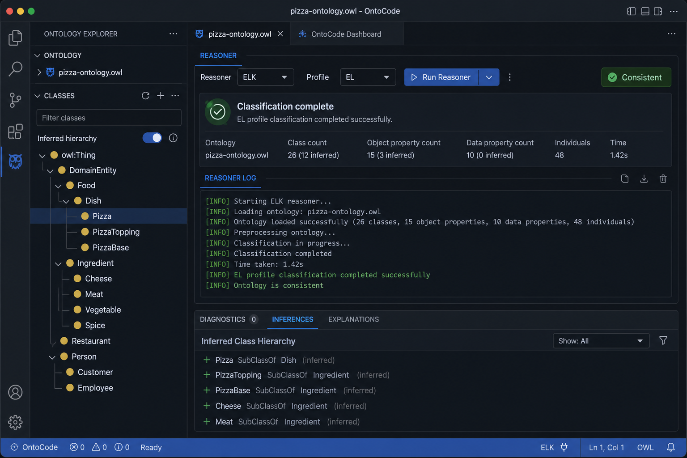
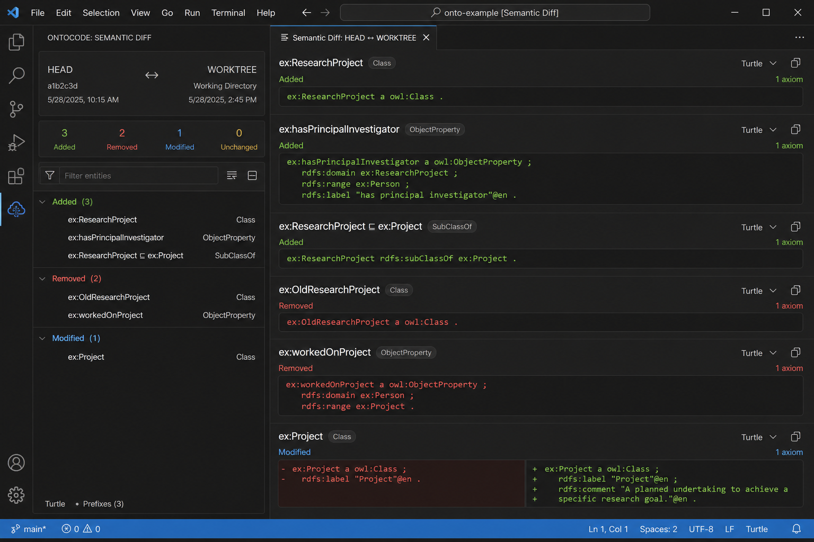

# OntoCode feature tour (current: v0.17)

A visual and structural overview of the OntoCode VS Code IDE. For hands-on setup, start with [First success (~10 min)](../guides/first-success.md).

Capability truth: [What ships today](../SHIPPED.md) · [Known limitations](../known-limitations.md).

## Activity bar and explorer

The **OntoCode** activity bar hosts five tree views:

| View | Purpose |
|------|---------|
| **Ontologies** | Indexed files, formats, parse status |
| **Classes** | Class hierarchy (asserted, or inferred/combined after reasoner) |
| **Properties** | Object, data, and annotation properties |
| **Individuals** | Named individuals |
| **Diagnostics** | Lint summaries grouped by severity |

**Typical flow:** expand **Classes** → click an entity name → **Entity Inspector** opens on the right. With Inspector and Graph panels open, the same entity stays in sync (**focus relay**).

## Entity Inspector (React)

The inspector shows IRI, kind, labels, comments, parents, children, and axioms. For **`.ttl`** and **`.obo`** files, the **Edit** section supports labels, parents, delete, and Manchester axioms.

!!! warning "Write-back formats"
    Turtle (`.ttl`) and OBO (`.obo`) support write-back. RDF/XML, OWL/XML (`.owl`, `.owx`), and JSON-LD are **read-only** — index and browse only.

Guide: [Inspector](inspector.md) · [Authoring](../authoring.md)

## Query Workbench (React)

Command Palette → **OntoCode: Open Query Workbench**

- **Catalog SQL (subset)** — virtual tables (`classes`, `properties`, `diagnostics`, …). Not full SQL — no `JOIN` / `ORDER BY` / `LIMIT`.
- **SPARQL mode** — graph patterns over indexed triples
- **Schema browser** — browse tables/columns; insert names into the editor
- Export results to CSV or JSON; history and saved queries

Guide: [Query Workbench](query-workbench.md) · [SQL reference](../sql-reference.md)

## Manchester editor (React)

Opened from the inspector or Command Palette for complex `SubClassOf`, `EquivalentClasses`, and `DisjointClasses` axioms. Validates Manchester syntax, previews Turtle, then applies to the `.ttl` file.

Guide: [Manchester editor](manchester-editor.md)

## Graph panels (React)

| Command | Graph |
|---------|-------|
| **Open Class Graph** | Subclass neighborhood around a class |
| **Open Property Graph** | Property domain/range neighborhood |
| **Open Import Graph** | Ontology import dependencies |
| **Open Neighborhood Graph** | Mixed entity neighborhood |

Click nodes to jump back to the Entity Inspector.

Guide: [Graph view](graph-view.md)

## Reasoner and explanation

| Panel | Purpose |
|-------|---------|
| **Reasoner Results** | Profile used, consistency, unsatisfiable classes, warnings |
| **Explanation** | EL-first justification for unsatisfiable classes (after reasoner run) |

After classification, use **Set Hierarchy Mode** (`asserted` / `inferred` / `combined`) to update the **Classes** tree.

Guide: [Reasoner](../guides/reasoner.md)

## Refactor preview and semantic diff (React)

| Panel | Purpose |
|-------|---------|
| **Refactor Preview** | Diff before rename, migrate, move, or extract module |
| **Semantic Diff** | Compare versions, directories, or workspace snapshots — axiom-level changes and breaking-change flags |

Guides: [Refactoring](../guides/refactoring.md) · [Semantic diff](semantic-diff.md)

## Manage Imports

Right-click a `.ttl` file in **Ontologies** → **Manage Imports** to add or remove `owl:imports` declarations with preview and apply.

Guide: [Manage Imports](manage-imports.md)

## Turtle semantic highlighting and diagnostics

In `.ttl` and `.obo` editors:

- **Semantic tokens** — namespaces, IRIs, keywords, comments
- **Configurable diagnostics** — `.ontocore/diagnostics.toml` or `ontocode.diagnostics.rules`

## Turtle completion and quick fixes

In `.ttl` editors:

- **Completion** on `:`, `<`, `@` — prefixes, QNames, catalog IRIs
- **Quick fixes** (lightbulb) for undefined prefix, missing label, and broken import diagnostics

Guide: [Authoring](../authoring.md) · [LSP API](../lsp-api.md)

## Editor integration

Open any supported ontology file (`.ttl`, `.owl`, `.obo`, …) for hover, go to definition, outline, workspace symbols, and Problems-panel diagnostics.

## Settings worth knowing

| Setting | Default | Notes |
|---------|---------|-------|
| `ontocode.lspPath` | empty | Override bundled `ontocore-lsp` (trusted workspaces only) |
| `ontocode.hierarchy.mode` | `asserted` | Switch after reasoner for inferred tree |
| `ontocode.reasoner.default` | `el` | Default profile for **Run Reasoner** |
| `ontocode.indexCache` | `false` | Optional `.ontocore/cache/` disk index |
| `ontocode.diagnostics.rules` | `{}` | Per-rule enable/severity |

Full list: [Install VS Code](../vscode-install.md#settings)

## Next steps

| Goal | Document |
|------|----------|
| Complete the tutorial | [First success](../guides/first-success.md) |
| From Protégé | [Migrating from Protégé](../guides/protege-migration.md) |
| CLI / CI without VS Code | [OntoCore overview](../ontocore/index.md) |
| Limits | [Known limitations](../known-limitations.md) |
