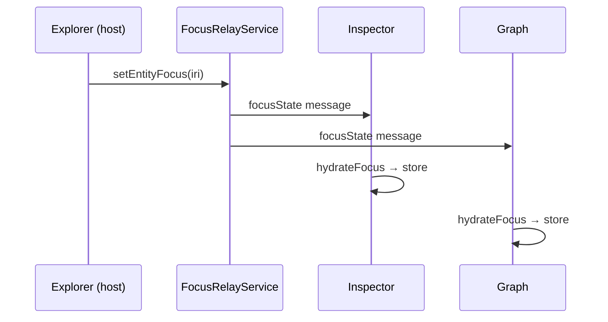

# Workspace runtime

> **Status:** **Shipped v0.13** · **ADR:** [0002](../adr/0002-workspace-over-panel-model.md), [0003](../adr/0003-current-focus-central-ux.md), [0004](../adr/0004-workspacestore-ui-source-of-truth.md)

## Scope

Defines **WorkspaceStore**, **Current Focus**, event bus, commands, **WorkspaceRegistry**, and **WorkspaceHost** — the OntoUI runtime that coordinates panel state across webviews.

## WorkspaceStore

Single source of truth for global OntoUI state. Local UI state (e.g. tree expansion) stays in workspace components.

**Location:** `extension/webview-ui/src/store/workspaceStore.ts`

```ts
interface WorkspaceStore {
  focus: CurrentFocus | null
  selection: SelectionState
  explorer: ExplorerState
  inspector: InspectorState
  graph: GraphState
  query: QueryState
  reasoning: ReasoningState
  refactor: RefactorState
  navigation: NavigationState
  // tabs, layout, diagnostics, ai, plugins — stubs for v1.0+
}
```

## Current Focus

```ts
type FocusKind =
  | "entity" | "axiom" | "query" | "diagnostic"
  | "graphNode" | "documentation" | "review"

interface CurrentFocus {
  kind: FocusKind
  id: string
  source: string
  timestamp: number
}
```

`setFocus` emits `FocusChanged` and updates inspector/graph/explorer slices. `hydrateFocus` applies relayed focus without pushing navigation history.

**Cross-webview sync:** VS Code webviews run in isolated contexts. The extension-host `FocusRelayService` (`extension/src/focus/focusRelay.ts`) broadcasts `focusState` and `reasoningState` messages; `FocusSyncBootstrap` hydrates the store in each webview.

## Event bus

Typed events only; no ad hoc postMessage between panels.

```ts
type WorkspaceEvent =
  | { type: "FocusChanged"; focus: CurrentFocus }
  | { type: "QueryExecuted"; language: "sql" | "sparql" }
  | { type: "ReasoningCompleted"; unsatisfiable: string[] }
  | { type: "RefactorPreviewReady"; planId: string }
  | { type: "RefactorCleared" }
```

**Location:** `extension/webview-ui/src/store/events.ts`

## WorkspaceRegistry

Maps workspace type → React root + lifecycle hooks.

**Location:** `extension/webview-ui/src/workspaces/registry.ts`

## WorkspaceHost

See [ONTOUI.md](ONTOUI.md). Bridges OntoUI to VS Code or OntoStudio. Webviews receive host via `HostContext`, not direct `acquireVsCodeApi` in every panel.

## Sequence: entity selection → focus sync



## Deferred (v1.0)

| Item | Target |
|------|--------|
| Persistent tabs + bottom dock | v1.0 |
| Full command registry in store | v1.0 |
| Manchester / Semantic Diff on store | v1.0 |

## Links

- [ui/STATE_MANAGEMENT.md](../ui/STATE_MANAGEMENT.md) (UX spec)
- [ui/WORKSPACE_MODEL.md](../ui/WORKSPACE_MODEL.md) (UX spec)
- [migration/v0.13.md](../migration/v0.13.md)
- [cursor-prompts/02-add-workspacestore.md](../cursor-prompts/02-add-workspacestore.md)

## Evolution

Consolidates [ui/STATE_MANAGEMENT.md](../ui/STATE_MANAGEMENT.md) and [ui/WORKSPACE_MODEL.md](../ui/WORKSPACE_MODEL.md) architecture sections. UX wireframes remain in ui/.
