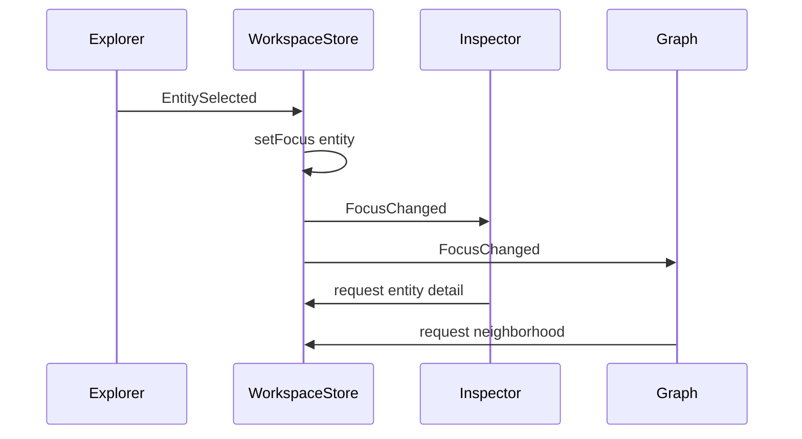

# Workspace runtime

> **Status:** Planned (v0.13) · **ADR:** [0002](../adr/0002-workspace-over-panel-model.md), [0003](../adr/0003-current-focus-central-ux.md), [0004](../adr/0004-workspacestore-ui-source-of-truth.md)

## Scope

Defines **WorkspaceStore**, **Current Focus**, event bus, commands, **WorkspaceRegistry**, and **WorkspaceHost** — the OntoUI runtime that replaces isolated per-panel state.

## WorkspaceStore

Single source of truth for global OntoUI state. Local UI state (e.g. tree expansion) stays in workspace components.

```ts
interface WorkspaceStore {
  focus: CurrentFocus | null
  selection: SelectionState
  tabs: TabState
  layout: LayoutState
  explorer: ExplorerState
  inspector: InspectorState
  graph: GraphState
  query: QueryState
  reasoning: ReasoningState
  diagnostics: DiagnosticsState
  ai: AIState
  plugins: PluginState
  navigation: NavigationState
}
```

**Planned location:** `extension/webview-ui/src/store/`

## Current Focus

```ts
type FocusKind =
  | "entity" | "axiom" | "query" | "diagnostic"
  | "graphNode" | "documentation" | "review"

interface CurrentFocus {
  kind: FocusKind
  id: string
  source: string
  timestamp: number
}
```

Changing focus emits `FocusChanged`. All subscribed workspaces update context (inspector, graph neighborhood, AI context builder).

**Status:** Planned — today each panel receives entity context via separate LSP calls.

## Event bus

Typed events only; no ad hoc postMessage between panels.

```ts
type WorkspaceEvent =
  | { type: "FocusChanged"; focus: CurrentFocus }
  | { type: "EntitySelected"; ref: SemanticRef }
  | { type: "QueryExecuted"; result: QueryResult }
  | { type: "ReasoningCompleted"; summary: ReasonerSummary }
  | { type: "DiagnosticsUpdated"; items: Diagnostic[] }
  | { type: "PatchPreviewReady"; preview: PatchPreview }
```

**Planned:** `extension/webview-ui/src/store/events.ts`

## Command system

Commands are declarative actions routed through the store (not scattered VS Code command handlers in webviews):

```ts
interface WorkspaceCommand {
  id: string
  execute(ctx: CommandContext): Promise<void>
}
```

Host forwards VS Code command palette entries to OntoUI command registry where appropriate.

## WorkspaceRegistry

Maps workspace type → React root + lifecycle hooks.

```ts
interface WorkspaceDefinition {
  id: string
  title: string
  component: React.ComponentType<WorkspaceProps>
  onFocusChange?(focus: CurrentFocus): void
}

interface WorkspaceRegistry {
  register(def: WorkspaceDefinition): void
  get(id: string): WorkspaceDefinition | undefined
  list(): WorkspaceDefinition[]
}
```

**Planned location:** `extension/webview-ui/src/workspaces/registry.ts`

## WorkspaceHost

See [ONTOUI.md](ONTOUI.md). Bridges OntoUI to VS Code or OntoStudio. Extension host implements host adapter; webviews receive host via context, not direct `acquireVsCodeApi` in every panel.

## Sequence: entity selection → focus sync



## Current code pointers

| Today | Target |
|-------|--------|
| `App.tsx` panel switch | WorkspaceRegistry + active tab |
| Per-panel `useState` | WorkspaceStore slices |
| Direct `postMessage` in panels | Host adapter + typed events |

## Links

- [ui/STATE_MANAGEMENT.md](../ui/STATE_MANAGEMENT.md) (UX spec)
- [ui/WORKSPACE_MODEL.md](../ui/WORKSPACE_MODEL.md) (UX spec)
- [ui/EVENT_SEQUENCE_DIAGRAMS.md](../ui/EVENT_SEQUENCE_DIAGRAMS.md)
- [cursor-prompts/02-add-workspacestore.md](../cursor-prompts/02-add-workspacestore.md)

## Evolution

Consolidates [ui/STATE_MANAGEMENT.md](../ui/STATE_MANAGEMENT.md) and [ui/WORKSPACE_MODEL.md](../ui/WORKSPACE_MODEL.md) architecture sections. UX wireframes remain in ui/.
