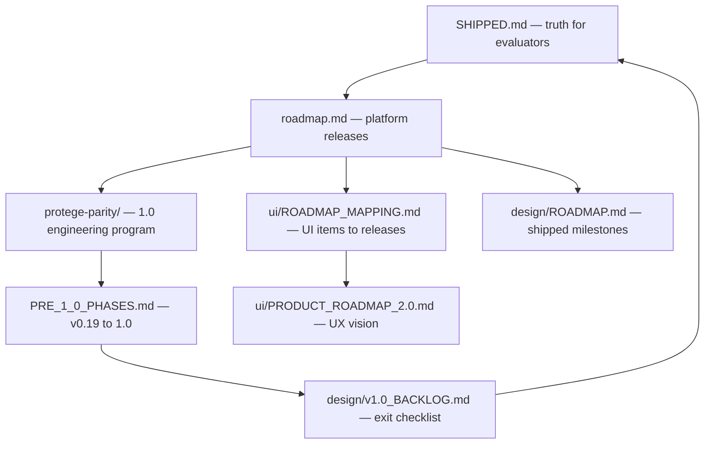

# Roadmap hub

OntoCode and OntoCore publish several roadmap documents. **Use this page to pick the right one** — they serve different audiences and must not be read as a single capability list.

**Current release:** v0.19.0 · [What ships today](SHIPPED.md)

## Which document should I read?

| I want to… | Read this |
|------------|-----------|
| See **what ships today** | [What ships today](SHIPPED.md) — canonical capability matrix |
| Learn **canonical terminology** | [Glossary](glossary.md) |
| **Implement** OntoUI / workspaces (v0.13–v0.14) | [Platform overview](https://github.com/eddiethedean/ontocode/blob/main/docs/platform/OVERVIEW.md) · [Plugin authoring](guides/plugins.md) · [Cursor prompts](https://github.com/eddiethedean/ontocode/blob/main/docs/cursor-prompts/README.md) |
| **Implement Protégé parity** (v0.19–1.0) | [Protégé parity program](protege-parity/README.md) · [Pre-1.0 phases](protege-parity/07_BACKLOG/PRE_1_0_PHASES.md) · [Execution order](protege-parity/05_IMPLEMENTATION/EXECUTION_ORDER.md) |
| Understand **platform direction** (releases v0.14 → v1.2) | [Platform roadmap](roadmap.md) · [ROADMAP.md on GitHub](https://github.com/eddiethedean/ontocode/blob/main/ROADMAP.md) |
| Map **UI design specs** to release phases | [UI roadmap mapping](https://github.com/eddiethedean/ontocode/blob/main/docs/ui/ROADMAP_MAPPING.md) — master checklist |
| See **UI phases with milestones** | [Product Roadmap 2.0](https://github.com/eddiethedean/ontocode/blob/main/docs/ui/PRODUCT_ROADMAP_2.0.md) |
| Read **product/platform ADRs** | [adr/README.md](adr/README.md) |
| Review **shipped engineering milestones** (v0.1–v0.11 detail) | [Design milestones](design/ROADMAP.md) |
| Track **v1.0 exit criteria** (contributor backlog) | [Pre-1.0 phases](protege-parity/07_BACKLOG/PRE_1_0_PHASES.md) · [v1.0 backlog](design/v1.0_BACKLOG.md) — not a shipped feature list |

## How they relate

## Rules of thumb

1. **Evaluators and new users:** start at [SHIPPED.md](SHIPPED.md), not a roadmap or UI spec.
2. **UI specs under `docs/ui/`** describe target UX — many items are planned for v1.0+. Cross-check [ROADMAP_MAPPING.md](https://github.com/eddiethedean/ontocode/blob/main/docs/ui/ROADMAP_MAPPING.md) (v0.13–v0.14 foundation items shipped).
3. **Unchecked boxes** in [v1.0 backlog](design/v1.0_BACKLOG.md) mean "v1.0 exit bar" — not "missing today."
4. **Release timeline** for procurement: [Release timeline](guides/release-timeline.md) (non-commitment disclaimer applies).

## Current release

**v0.19.0** — see [Migration v0.18.2 → v0.19.0](migration/v0.19.md), [v0.18 overview](migration/v0.18.md), and [Changelog](changelog.md).

> **Design docs under `docs/platform/`, `docs/ui/`, and Protégé reverse-engineering are not a shipped feature list.** Cross-check [SHIPPED.md](SHIPPED.md) before treating a design page as product capability.
