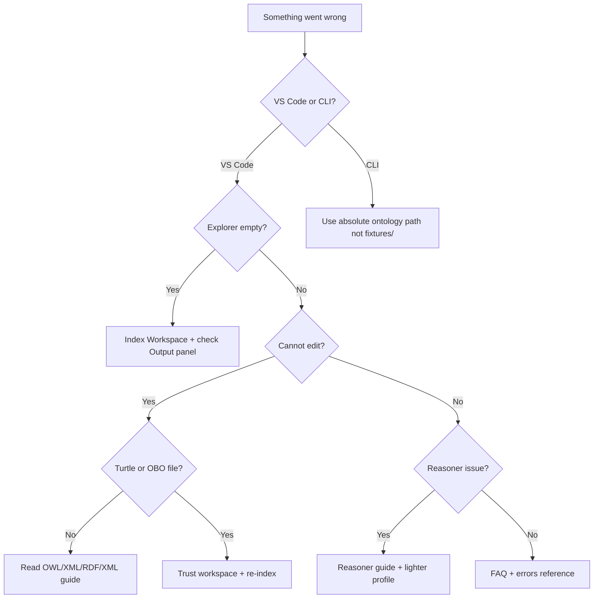

# Troubleshooting

Common problems and fixes for OntoCode (VS Code) and OntoCore (CLI/LSP).

For quick answers, see also [FAQ](faq.md).

## Where to start (symptom → guide)

| Symptom | Likely cause | Read first |
|---------|--------------|------------|
| Explorer empty or stale | Not indexed, wrong folder, unsupported format | [Explorer empty](#vs-code-explorer-empty-or-stale) |
| Language server failed to start | Untrusted workspace, bad `lspPath`, duplicate extension | [LSP failed](#vs-code-language-server-failed-to-start) |
| Cannot edit in inspector | Wrong format (`.owl`/`.owx`/JSON-LD read-only), wrong file | [Cannot edit](#vs-code-cannot-edit-in-inspector) |
| Patch / Manchester did not stick | Buffer vs disk conflict, stale index | [Patch did not stick](#vs-code-patch-or-manchester-apply-did-not-stick) |
| `fixtures/` path fails in CLI | Using clone-only paths after `cargo install` | [CLI fixtures](#cli-ontocore-query-fixtures-fails) |
| `validate` exits non-zero | Diagnostic errors in ontology | [Validate exit](#cli-validate-exits-non-zero) |
| Query returns no rows | Stale index, wrong table/column names | [Query empty](#queries-return-no-rows-or-wrong-data) |
| Reasoner errors or empty hierarchy | Profile mismatch, OntoLogos, unsat classes | [Reasoner](#reasoner) |
| Cannot edit `.obo` | Pre-v0.12 extension or term not in `.obo` file | [Graphs, OBO, ROBOT](#graphs-obo-robot-and-semantic-diff) |
| Semantic diff / graph missing | No git repo, not indexed | [Graphs, OBO, ROBOT](#graphs-obo-robot-and-semantic-diff) |
| Inspector and graph show different entities | Panels opened before v0.13 or focus relay disabled | Re-open panels; click entity in explorer — [migration v0.13](migration/v0.13.md) |
| Schema browser empty in Query Workbench | Workspace not indexed or SPARQL mode selected | Index workspace; switch to SQL mode — [Query Workbench](ontocode/query-workbench.md) |
| OWL/XML visible but not editable | Read-only by design (v0.12+) | [OWL/XML workflow](guides/owl-xml-workflow.md) |

Need help beyond this page? See [Support and contact](support.md).



## VS Code: explorer empty or stale

1. Run **OntoCode: Index Workspace** from the Command Palette.
2. Check **View → Output → OntoCore Language Server** for errors.
3. Confirm the folder contains supported files (`.ttl`, `.owl`, `.rdf`, `.jsonld`, `.nt`, `.nq`, `.trig`).
4. **Multi-root workspace:** since v0.10 all folders are indexed — confirm each root contains ontology files and check **Output → OntoCore Language Server** for per-root errors.

## VS Code: language server failed to start

1. **Trust** the workspace (Restricted Mode blocks custom `ontocode.lspPath`).
2. Uninstall duplicate OntoCode extension versions.
3. Check **Output → OntoCore Language Server** for the exact error.
4. Set `ontocode.lspPath` to a local `ontocore-lsp` binary (`cargo install ontocore-lsp`) — trusted workspaces only.
5. See [Install VS Code](vscode-install.md#troubleshooting).

## VS Code: cannot edit in inspector

- Write-back applies to **Turtle (`.ttl`) and OBO (`.obo`)** (v0.12+). See [Supported formats](supported-formats.md) for the full matrix. RDF/XML, OWL/XML, and JSON-LD are read-only.
- Entity must be declared in an indexed `.ttl` or `.obo` file in the workspace.
- See [OBO authoring](ontocode/obo-authoring.md).

## VS Code: patch or Manchester apply did not stick

Patches write the **source file on disk** first (`.ttl` or `.obo`), then update the language server’s open-buffer copy:

1. If the editor still shows old text, accept or re-apply the workspace edit, or reload the file from disk.
2. If you had **unsaved** local edits that conflicted, review the file on disk — the server applied against its buffer/disk snapshot.
3. If re-index fails after a successful write, the catalog may be stale. Run **OntoCode: Index Workspace**.
4. Check **View → Output → OntoCore Language Server** and [errors reference](errors.md).

## CLI: `ontocore query ./fixtures` fails

The `fixtures/` directory exists only in a **git clone**, not after `cargo install`:

```bash
ontocore query /path/to/your/ontologies "SELECT * FROM classes"
```

## CLI: install and PATH

| Symptom | Fix |
|---------|-----|
| `ontocore: command not found` after `cargo install` | Add `~/.cargo/bin` to your `PATH` — see [Getting started](getting-started.md#prerequisites) |
| `cargo install` fails with MSRV / edition error | Run `rustup update stable`; require Rust **1.88+** (`rustc --version`) |
| `cargo install` network / crates.io errors | Retry with `--locked`; pin `--version 0.17.0` in CI |
| Release tarball on macOS/Windows | CLI pre-builds are **Linux x64 only** — use `cargo install` or the VSIX extension |
| `ontocore diff HEAD..WORKTREE` fails | Run from a **git repository** root containing ontology files |

## CLI: `validate` exits non-zero

Exit code **0** only when there are no diagnostic **errors** (warnings are allowed). Query errors:

```bash
ontocore query /path/to/ontologies "SELECT code, severity, message FROM diagnostics WHERE severity = 'error'"
```

See [CI integration](ci-integration.md).

## Queries return no rows or wrong data

1. Re-index: `ontocore validate` or VS Code **Index Workspace**.
2. Confirm SQL table name and column names — [SQL reference](sql-reference.md).
3. SPARQL runs over indexed triples — prefix declarations must be valid in source files.

## Results truncated at 100,000 rows

Both SQL and SPARQL cap results at **100,000 rows** with silent truncation. In the Query Workbench or LSP responses, check `truncated: true`. Narrow your query with `WHERE` or SPARQL `LIMIT`.

See [workspace limits](workspace-limits.md).

## Patch JSON errors

| Symptom | Likely cause |
|---------|--------------|
| `entity not found` | Wrong IRI or entity not in target `.ttl` file; check `@prefix` declarations |
| `unsupported format` | Patch target is not Turtle (`.ttl`) or OBO (`.obo`); use format-specific ops |
| `applied: false` with diagnostics | Invalid patch op or Manchester expression — see [patch reference](patch-reference.md) |

## Workspace too large

Indexing may fail above [workspace limits](workspace-limits.md) (file count, size, triple caps). For very large terminologies, use CLI batch workflows on a subset.

## Graphs, OBO, ROBOT, and semantic diff

| Problem | What to try |
|---------|-------------|
| Semantic diff: `no git repository` | Open a git checkout; or use CLI `ontocore diff --left-ref ./a --right-ref ./b` |
| Semantic diff panel empty | Trust workspace; run **Index Workspace**; see [Semantic diff](ontocode/semantic-diff.md) |
| Graph commands missing | Run **Index Workspace** first — [Graph view](ontocode/graph-view.md) |
| Cannot edit `.obo` in inspector | Confirm OntoCode **v0.12.0+**; entity must be in an indexed `.obo` file — [OBO guide](guides/obo-workflow.md) |
| `robot` not found | Install Java + ROBOT; set `ontocode.robotPath` — [ROBOT guide](guides/robot-interop.md) |

## Reasoner

| Problem | What to try |
|---------|-------------|
| Reasoner command missing or greyed out | Trust workspace; run **Index Workspace** first |
| `OntoLogos` / classify errors | Confirm ontology fits [workspace limits](workspace-limits.md); try lighter profile (`el`, `rl`, `rdfs`) |
| `dl` or `auto` profile fails | DL requires supported constructs; check Output panel; try `el` for EL-only ontologies; see [Reasoner guide](guides/reasoner.md) |
| Reasoner runs but no inferred edges | Run **OntoCode: Run Reasoner**, then **Set Hierarchy Mode** → inferred or combined |
| Explanation panel empty | Explanations need an unsatisfiable class; run reasoner first; DL explanations require v0.12+ |
| Classify exits non-zero in CI | Ontology has unsatisfiable classes — inspect JSON `unsatisfiable` list |
| Reasoner timeout / hang | Large ontologies may exceed memory caps — subset or use `el` profile; see [Performance and sizing](guides/performance-sizing.md) |

See [Reasoner guide](guides/reasoner.md).

## Still stuck?

- [FAQ](faq.md)
- [Errors reference](errors.md)
- [Report an issue](https://github.com/eddiethedean/ontocode/issues)
