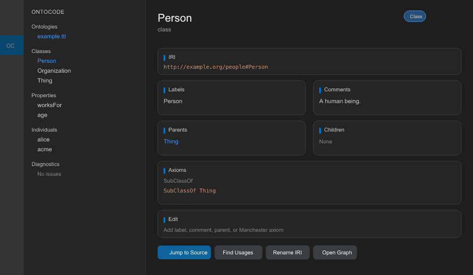

# OntoCode

**Browse OWL/RDF ontologies in VS Code** — index a workspace, explore classes and properties in the sidebar, inspect entities, and jump to Turtle/RDF source.

---

## Quick start

1. **Install** OntoCode from the Marketplace (you are here).
2. **File → Open Folder…** and choose a project that contains ontology files.
3. If VS Code asks, **Trust** the workspace (required for the bundled language server).
4. Click the **OntoCode** icon in the **Activity Bar** (left edge of the window).
5. Open **Classes**, **Properties**, or **Individuals** and **click an entity name** to open the Entity Inspector.

OntoCode indexes supported files automatically when the folder opens (`ontocode.autoIndexOnOpen`, default **on**).

---

## Supported files

OntoCode activates when your workspace contains any of:

| Extension | Format |
|-----------|--------|
| `.ttl` | Turtle |
| `.owl`, `.rdf` | RDF/XML |
| `.jsonld`, `.json-ld` | JSON-LD |
| `.nt`, `.nq` | N-Triples / N-Quads |
| `.trig` | TriG |

You can also open the **OntoCode → Ontologies** view to force activation.

---

## Using the sidebar

After indexing, the **OntoCode** activity bar shows five views:

| View | What you see |
|------|----------------|
| **Ontologies** | Indexed `.ttl` / `.owl` / … files and parse status |
| **Classes** | Class hierarchy (subclasses nested under parents) |
| **Properties** | Object, data, and annotation properties (grouped) |
| **Individuals** | Named individuals |
| **Diagnostics** | Lint issues grouped by severity (Problems panel + sidebar); click to open source |

**Refresh** — click the ↻ icon on any view title, or run **OntoCode: Refresh Explorer**.

**Re-index** — run **OntoCode: Index Workspace** from the Command Palette (`Ctrl+Shift+P` / `Cmd+Shift+P`) after you add or change ontology files.

---

## Entity Inspector

To inspect a class, property, or individual:

1. Expand **Classes** (or **Properties** / **Individuals**).
2. **Click the entity name** (e.g. `Person`).

The **Entity Inspector** panel opens with:

- IRI and kind (class, object property, individual, …)
- Labels and comments
- Parent and child classes
- Axioms (e.g. `SubClassOf`)
- **Jump to Source** — opens the `.ttl` / `.owl` file at the declaration

**Right-click** an entity for **Jump to Source** in the context menu.

**Command Palette:** **OntoCode: Show Entity Inspector** — paste an entity IRI if you know it.

---

## In the editor

Open a `.ttl` (or other supported) file and use standard VS Code navigation:

| Action | Shortcut (macOS) | Shortcut (Windows/Linux) |
|--------|------------------|--------------------------|
| Hover summary on an IRI | hover | hover |
| Go to definition | `F12` | `F12` |
| Document outline (symbols) | `Cmd+Shift+O` | `Ctrl+Shift+O` |
| Workspace symbol search | `Cmd+T` | `Ctrl+T` |

---

## Command Palette

| Command | When to use |
|---------|-------------|
| **OntoCode: Index Workspace** | After adding/changing ontology files |
| **OntoCode: Refresh Explorer** | Reload tree views from the catalog |
| **OntoCode: Show Entity Inspector** | Open inspector by IRI |
| **OntoCode: Jump to Source** | Go to declaration by IRI |

---

## Settings

Open **Settings** and search `ontocode`:

| Setting | Default | Description |
|---------|---------|-------------|
| `ontocode.autoIndexOnOpen` | `true` | Index the workspace when OntoCode activates |
| `ontocode.lspPath` | *(empty)* | Path to `ontoindex-lsp` binary. **Trusted workspaces only.** Leave empty to use the bundled server |

---

## Troubleshooting

| Problem | What to try |
|---------|-------------|
| Sidebar says *“Index workspace to browse ontologies”* | Run **OntoCode: Index Workspace**; confirm the folder contains `.ttl`, `.owl`, etc. |
| Extension never activates | Open a supported ontology file, or click **OntoCode → Ontologies** |
| `failed to start language server` | Check **View → Output → OntoIndex Language Server**. Uninstall older OntoCode versions. Set `ontocode.lspPath` or run `cargo install ontoindex-lsp` |
| Empty **Classes** after indexing | **Output → OntoIndex Language Server** for errors; run **Index Workspace** again |
| No items under **Diagnostics** | Index must complete first; check **Problems** panel for the same issues |
| Workspace is Restricted | **Trust** the folder — `ontocode.lspPath` is ignored in Restricted Mode |

More detail: [Installation & troubleshooting](https://github.com/eddiethedean/ontocode/blob/main/docs/vscode-install.md)

---

## What’s included in v0.3.0

**Shipped today:** explorer, entity inspector, jump-to-source, hover, symbols, go-to-definition, **ontology diagnostics** (Problems panel + Diagnostics sidebar), `ontoindex validate` integration.

**Planned:** axiom editing, query workbench, reasoners — see the [roadmap](https://github.com/eddiethedean/ontocode/blob/main/docs/design/ROADMAP.md).

---

## Platform support

Release builds bundle `ontoindex-lsp` for Linux (x64, arm64), macOS (Apple Silicon, Intel), and Windows (x64). No extra install needed on those platforms.

---

## Links

- [GitHub repository](https://github.com/eddiethedean/ontocode)
- [Report an issue](https://github.com/eddiethedean/ontocode/issues)
- [Changelog](https://github.com/eddiethedean/ontocode/blob/main/CHANGELOG.md)

**Contributing / building from source:** see the [repo README](https://github.com/eddiethedean/ontocode#development).
